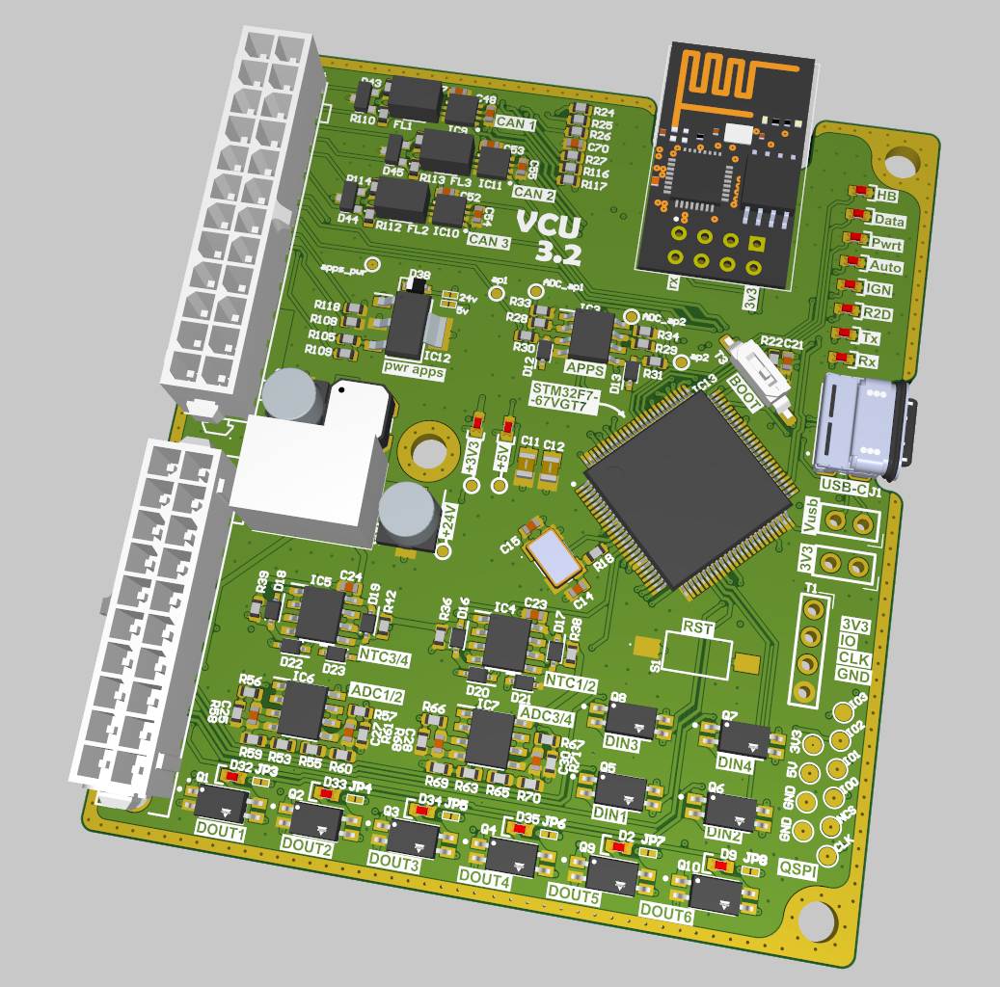
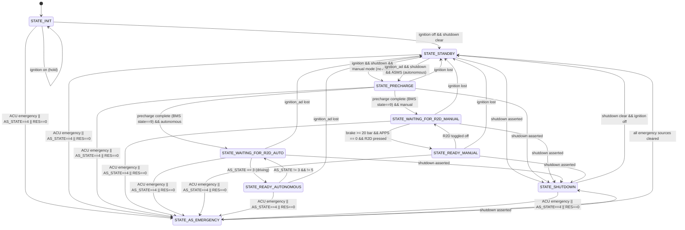

# VCU Firmware — STM32F767



Bare-metal firmware for the Vehicle Control Unit (VCU) of a Formula Student electric race car. Manages HV system state, throttle-by-wire, safety monitoring, and dual-mode operation (manual driver + autonomous).

## Hardware

| Component | Detail |
|---|---|
| **MCU** | STM32F767VGTx — ARM Cortex-M7, 216 MHz, 1 MB Flash, 512 KB RAM |
| **CAN buses** | 3x at 500 kbps (CAN1 Data, CAN2 Powertrain, CAN3 Autonomous) |
| **USART** | 3x (USART3 for debug `printf`, USART1 for auxiliary) |
| **ADC** | ADC1 with DMA (brake pressure + 3 spare channels), ADC2 (dual APPS) |
| **PWM** | TIM4 CH1 (buzzer / cooling pump), TIM1 (cooling) |
| **GPIOs** | Brake light, R2D buzzer, 5 status LEDs (IGN, R2D, AUTO, PWT, DATA, Heartbeat), water pump, BMS ignition |
| **Watchdog** | IWDG — resets MCU on main loop stall |

## Architecture

The firmware runs a **bare-metal super-loop** with no RTOS. A hardware timer tick (`HAL_GetTick`) drives time-sliced task execution:

- **Immediate** (every loop): state machine update, APPS moving average, heartbeat LED
- **10 ms (100 Hz)**: APPS processing, CAN autonomous HV signal, TX queue drain, APPS timeout check
- **100 ms (10 Hz)**: brake light control, VCU telemetry frames (rotated across 5 frames), VCU-IGN-R2D status broadcast

CAN RX is interrupt-driven — ISRs push received frames into **per-bus ring-buffer queues** (`can_queue_t`, 32 entries each). The main loop pops and decodes them outside ISR context, avoiding priority inversion and keeping ISRs fast. TX is similarly queued with one queue per bus to prevent head-of-line blocking across the three independent bxCAN peripherals.

CAN message codecs (encode/decode) in `Core/Dbc/` are **auto-generated from DBC files** using [cantools](https://cantools.readthedocs.io/), ensuring signal definitions stay in sync with the rest of the car's toolchain.

## State Machine



## CAN Bus Architecture

| Bus | Name | Baud | Purpose | Connected Nodes |
|---|---|---|---|---|
| **CAN1** | Data | 1Mbps | Telemetry, sensors | VCU TX (0x20-0x25), IMU, wheel speed, suspension dynamics |
| **CAN2** | Powertrain | 1Mbps | Drivetrain control | FSIC INV1 + INV2 (dual rear inverters), BMS, IVT |
| **CAN3** | Autonomous | 1Mbps | AS interface | Jetson Orin, ACU, RES |

### Autonomous Interface (CAN3)

**VCU Transmits:**

//TODO

**VCU Receives:**

//TODO

## Safety & Protections

### APPS (Accelerator Pedal Position Sensor)

- **Dual-channel** sensors with independent ADC readings
- **Disagreement detection**: triggers if delta exceeds 10% of functional range
- **Short circuit detection**: values outside 50–4050 ADC range (12-bit)
- **Sensors shorted together**: delta < 10 ADC bits
- **Debouncing**: 100 ms error timeout — error must persist before triggering cutoff
- **CAN timeout**: 50 ms — if APPS CAN frame is lost, throttle zeros
- **Moving average filter**: window size 5 for noise rejection

### digital protection for BSPD (Brake System Plausibility Device)

- Digital implementation with **100 ms activation delay** so the hardware one does not trigger
- Triggers when brake pressure >= 20 bar **AND** throttle >= 0 simultaneously
- Cuts throttle to zero when active
- Near-instant deactivation (1 ms) when fault clears

### Emergency Handling

Three **independent** emergency sources, highest priority in the system:

1. **ACU emergency** (`acu.is_in_emergency == 1`)
2. **AS_STATE == 4** (autonomous emergency)
3. **RES == 0** (Remote Emergency Shutdown active)

Any source triggers immediate transition to `STATE_AS_EMERGENCY` from **any** state. BMS precharge is disabled, inverters are commanded off, and an intermittent buzzer sounds (2.5 Hz, 9 seconds).

### Timeouts

- **Autonomous command timeout**: 200 ms — zeros inverter if no RPM/torque command received
- **APPS CAN timeout**: 50 ms — cuts throttle on communication loss
- **Vital signal monitoring**: inverter, ACU, and AS states checked for freshness

### Watchdog

- **IWDG** (Independent Watchdog) supervises the main loop
- MCU is reset if the loop stalls or hangs

### Power Limiting

- **65 kW threshold**: linear derating begins above 65 kW
- **70 kW hard limit**: throttle capped to 20% at 70 kW
- **Regenerative braking**: unlimited — power limiting only applies to positive (acceleration) values

## Control Algorithms

### PI Controller (Cooling)

A Proportional-Integral controller manages the cooling pump PWM based on three temperature sensor inputs (Steinhart-Hart thermistor conversion). Anti-windup protection prevents integral saturation. Output range: 0–100% duty cycle.

### Throttle Mapping

APPS raw ADC values are mapped to 0–100% (or 0–1000 for high-resolution) using calibrated min/max thresholds with tolerance bands. The mean of both sensor channels (after delta adjustment) is used for the final output.


### Regenerate DBC Codecs

```bash
cantools generate --database-file <bus>.dbc <output>.c <output>.h
```

DBC source files are in `Core/Dbc/`. Generated headers define pack/unpack functions for each CAN message.
or go copy from https://github.com/FSLART/T26_DBC.git

## License

MIT License. See individual source file headers for cantools-generated code licensing.
